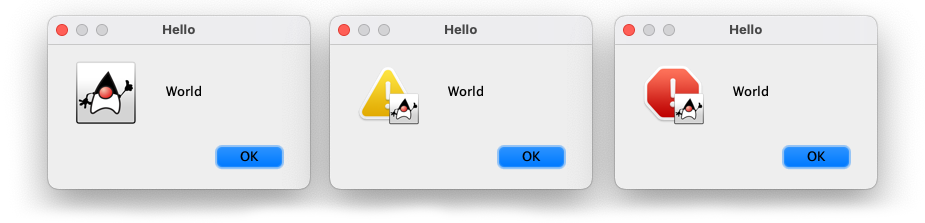
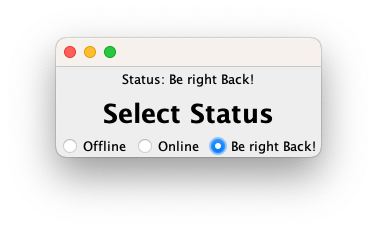
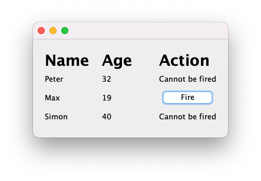
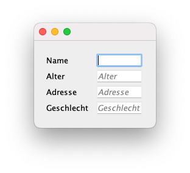

<p align="center">
  
</p>

# AHPE

> **A**HPE **H**ELPS **P**ASSING **E**XAMS

## File (`AhpeFile`)

Verschieden Dateioperationen:

### Schreiben

```java
final File file = new File("hello.txt"); 


// 'Hallo Welt!' in Datei schreiben
// (falls die Datei nicht existiert, wird sie erstellt)
AhpeFile.append(file, "Hallo Welt!")

// 'Hallo Welt!\n' in Datei schreiben
// (falls die Datei nicht existiert, wird sie erstellt)
AhpeFile.appendLine(file, "Hallo Welt!")

// In Datei mit max. 5 Zeilen schreiben
// (falls die Datei nicht existiert, wird sie erstellt)
for(int i = 0; i < 20; i++) AhpeFile.appendLineMax(file, "hi" + i, 2);
// in Datei steht:
// [ 1 ] hi18
// [ 2 ] hi19

// ⭐️ Datei mit Inhalt überschreiben
// Die Datei wird vor dem Schreiben geleert.
// (falls die Datei nicht existiert, wird sie erstellt)
AhpeFile.write(file, "Was geht ABAP?");
```

### Lesen

> **Note**: Wenn eine Datei nicht existiert 
> und dann von Ahpe gelesen werden soll, wird `null` zurückgegeben.
> Daher ist es empfehlenswert, vorher zu überprüfen, ob die Datei existiert.

```java
final File file = new File("hello.txt"); 

// Alle Zeilen aus Datei lesen
for (final String line : AhpeFile.readLines(file)) {
    System.out.println(line);
}

// Die ersten 5 Zeilen aus Datei lesen
for (final String line : AhpeFile.readFirstLines(file, 5)) // ...

// Die letzten 5 Zeilen aus Datei lesen
for (final String line : AhpeFile.readLastLines(file, 5)) // ...

// ⭐️ Datei-Inhalt als String lesen
// Kann '\n' beinhalten.
final String content = AhpeFile.read(file);
```

### Parsen von CSV/TSV-Dateien

> **Warning**: Kommt in der Klausur höchstwahrscheinlich nicht vor.
> Wurde nur für den Fall der Fälle hinzugefügt.

Falls irgendwelche Daten aus einer CSV oder TSV-Datei
geparsed werden sollen, kann ggf. die 
`AhpeFile#parseSeparatedFile`-Methode helfen.

In folgenden Fall kann man die Daten einfach parsen:

```
peter,22,deutschland
max,24,schweiz
martin,26,niederlande
```

1. Passende Klasse mit passendem Konstruktor (public!) zu Daten erstellen
```java
class Person {
    // ...
    public Person (final String name, final int age, final String country) {
        // ...
    }
}
```

2. Datei und Separator (`,`) übergeben
```java
final List<Person> persons = AhpeFile.parseSeparatedFile(file, ",", Person.class);
```

3. Dateien werden automatisch mit Typen geparsed
```java
for (final Person person : persons) {
    System.out.println(person);
}
// Person[name=peter, age=22, country=deutschland]
// Person[name=max, age=24, country=schweiz]
// Person[name=martin, age=26, country=niederlande]
```

## Random (`AhpeRandom`)

```java
// Zufällige ganze Zahl zwischen 1 und 10 (inklusive)
final int random = AhpeRandom.randomNumber(1, 10);

// Zufällige Farbe
final Color color = AhpeRandom.randomColor();

// Zufällige Farbe
// mit Max-Werten (inklusive)
final Color color = AhpeRandom.randomColor(200);

// ⭐️ Zufällige Farbe
// mit Min- und Max-Werten (inklusive)
final Color color = AhpeRandom.randomColor(10, 200);

// Zufälliger Wert aus Array
final String name = AhpeRandom.randomArray(new String[] {"peter", "max", "martin"});

// ⭐️ Zufälliger Wert aus Liste
final String name = AhpeRandom.randomList(Arrays.asList("peter", "max", "martin"));
```

## Thread (`AhpeThread`)

```java
// Aktion nach 10 Sekunden ausführen
AhpeThread.after(10, TimeUnit.SECONDS, () -> {
    // ... 
});


// ⭐️ Aktion alle 10 Sekunden ausführen
AhpeThread.every(10, TimeUnit.SECONDS, () -> {
    // ...
});
// Alias: ApheThread.everySecond(() -> { ... });
// Alias: ApheThread.everyMinute(() -> { ... });

// ⭐️ Aktion alle 5 Sekunden ausführen mit Beenden
AhpeThread.every(5, TimeUnit.SECONDS, (tick) -> {
    // wird true zurückgegeben, wird die Aktion beendet
    return tick > 10; // nach 10 * 5 Sekunden
});
// Alias: ApheThread.everySecond((tick) -> { ... });
// Alias: ApheThread.everyMinute((tick) -> { ... });

// ⭐️ Countdown für 10 Sekunden
AhpeThread.countdown(10, 
  // Wird jede Sekunde ausgeführt
  (remaining) -> {
      System.out.println("Noch " + remaining + " Sekunden");
  }, 
  // Wird ausgeführt, wenn Countdown abgelaufen ist
  () -> {
      System.out.println("Countdown abgelaufen");
  }
);

// ⭐️ Countdown für 10 Sekunden mit Beenden
// True in onRemaining zurückgeben, um den Countdown zu beenden
AhpeThread.countdownWithCondition(seconds, onRemaining, onDone);

// ⭐️ Counter für 10 Sekunden
AhpeThread.count(10, 
  // Wird jede Sekunde ausgeführt
  (tick) -> {
      System.out.println(remaining + " Sekunden gezählt");
  }, 
  // Wird ausgeführt, wenn Counter Ziel erreicht hat
  () -> {
      System.out.println("Counter hat das Ziel erreicht");
  }
);

// ⭐️ Counter für 10 Sekunden mit Beenden
// True in onTick zurückgeben, um den Counter zu beenden
AhpeThread.countWithCondition(seconds, onTick, onDone);
```

## Misc (`AhpeMisc`)

```java
// Prüfen ob a <= b <= c
if (AhpeMath.between(a, b, c)) { /* ... */ }

// Prüfen ob a < b < c
if (AhpeMath.betweenEx(a, b, c)) { /* ... */ }

// ROT-13 "Verschlüsselung"
final String encrypted = AhpeMisc.rot13("hallo");

// Größte Zahl aus Array
final int/double/float max = AhpeMisc.max(1, 2, 3, 5, 1);

// Größter Wert mit Comparator
final T max = AhpeMisc.max(new Comparator<T, T>() {
    @Override
    public int compare(T o1, T o2) {
        return o1.getValue() - o2.getValue();
    }
}, new T(1), new T(2), new T(3));

// Kleinste Zahl aus Array
final int/double/float min = AhpeMisc.min(1, 2, 3, 5, 1);

// Kleinster Wert mit Comparator
final T min = AhpeMisc.min(new Comparator<T, T>() {
    @Override
    public int compare(T o1, T o2) {
        return o1.getValue() - o2.getValue();
    }
}, new T(1), new T(2), new T(3));
```
## Dialog (`AhpeDialog`)

```java

Aliases zu `JOptionPane`:



```java
ApheDialog.info("Hello", "World");
ApheDialog.warn("Hello", "World");
ApheDialog.error("Hello", "World");
```

## Swing (*Swag*)

> **Note**: Für folgende Komponenten muss das
> [`io.d2a.swag`](https://github.com/darmiel/swag/tree/master/src/main/java/io/d2a/swag)
> Package ebenfalls in das Projekt übernommen werden.

### Enum Radio Button Group

Zeigt Radio Buttons mit den Werten von einem Objekt (oder Enums) an.  
Beim Wechsel wird `onChange` mit dem neuen State aufgerufen.



```java
enum State {
    ONLINE,
    OFFLINE,
    DND
}
// ...
final JPanel panel = Radio.group(State.OFFLINE, State.ONLINE, State.DND) // oder Radio.group(State.values()) für alle Werte eines Enums
    .onChange(state -> { // auch als BiConsumer<T, ActionEvent> verfügbar
        System.out.println("Switched State to: " + state);
    })
    .asPanel(); // oder `.addTo(JPanel)` für direktes Hinzufügen
```

---

### Placeholders

Die `Placeholder`-Klasse erlaubt es, Platzhalter in `JTextField`s und `JTextArea`s anzuzeigen:

https://user-images.githubusercontent.com/71837281/195694951-6f9f1007-491b-4b0e-ad6b-13a562604783.mov

> `Placeholder#extend(String, [JTextField, JTextArea, JPasswordField])`

```java
final JTextField nameField = new JTextField();
final JTextField ageField = new JTextField();
// ...
this.add(Placeholder.extend("Name", nameField));
this.add(Placeholder.extend("Alter", ageField));
```

---

### Layouts

```java
// ⭐️ BorderLayout
this.add(Border.create()
    .top(new JLabel("Top")) // oder .north()
    .right(new JLabel("Right")) // oder .east()
    .bottom(new JButton("Bottom")) // oder .south()
    .left(new JLabel("Left"))); // oder .west()

// BoxLayout
this.add(Box.vertical()
    .with(new JLabel("Hello")
    .with(Box.horizontal()
        .with(new JLabel("World"))
        .with(new JButton("Klick!")))));

// FlowLayout
this.add(Flow.center() // oder Flow.center(new JLabel("Hello"))
    .with(new JLabel("Hello"))
    .with(Flow.left().with(/* ... */))); // left, right, center
```

---

#### Grid



```java
// Grid
this.add(Grid.builder()
    .headers("Name", "Age", "Action")
    .with("Max", 28, new JButton("Fire!"))
    .with("Luca H", 20, new JButton("Fire!!!"))
    .with("Simon", 40, "Cannot be fired")
    .build());
```

Kann auch für Eingabfelder verwendet werden:



```java
this.add(Grid.builder()
        .with("Name", new JTextField())
        .with("Alter", new JTextField())
        .with("Adresse", new JTextField())
        .with("Geschlecht", new JTextField())
        .build());
```

---

#### Buttons and Layouts

Folgende Komponenten stehen im Method-Chaining-Pattern zur Verfügung:

**Button**
```java
this.add(new Button("Title")
    .click(() -> {
        // Knopf wurde gedrückt
    })
    .text("Neuer Text")
    .disable()
    .raw(jButton -> {
        // ⭐️ Direkter Zugriff auf die JButton-Instanz
        jButton.setEnabled(false);
    })
    .build());
```

**TextField/TextArea**
```java
this.add(new TextField(10)
    .enter(() -> {
        // Enter wurde gedrückt
    })
    .key('a', () -> {
        // a wurde gedrückt
    })
    .font(new Font(/* ... */))
    .raw(jTextField -> { /* ... */ }) // ⭐️ Direkter Zugriff auf die JTextField-Instanz
    .build());
```

**Komplettes Beispiel**
```java
this.add(Box.vertical()
    .with(Header.of("Knopf"))
    .with(Placeholder.extend("Name",new TextField()
            .enter(() -> System.out.println("Pressed Enter!")))
        )
    .with(Box.horizontal()
        .with(new Button("Klick")
            .click((event) -> System.out.println("Ich wurde geklickt"))
            .focus())
        .with(new Button("Mich auch")
            .click(this::handleClick)
            .disable())
    )
    .with(Grid.builder()
        .headers("Name", "Alter")
        .with("Peter", 12)
        .with("Max", new Button("Loeschen")
        .click((event) -> delete("Max"))
    ))
);
```